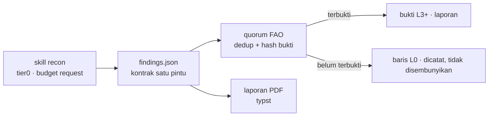

<div align="center">

# cyphron

**Bukti, bukan klaim.**

Mesin security assessment yang berangkat dari bukti. Skill deteksi
ditulis di Python, core-nya native Rust, dan keduanya tunduk pada satu
kontrak output yang ketat.

*Tanpa bukti, tanpa laporan.*

[](https://github.com/maulanawirawan/cyphron/actions/workflows/ci.yml)
[](#isinya-apa-aja)
[](https://github.com/maulanawirawan/cyphron/releases)
[](#isinya-apa-saja)
[](#mulai-cepat)
[](#mulai-cepat)
[](LICENSE)

[English](README.md) · **Bahasa Indonesia** · [中文](README.zh.md) · [Español](README.es.md)

</div>

---

## Pakai dari agent-mu

cyphron dikirim sebagai CLI satu command dengan mode, file skill yang
bisa dimuat agent, dan MCP server — jadi Claude Code, Cursor, ZCode,
atau agent apa pun yang bisa menjalankan shell bisa mengendalikannya
langsung.

```bash
git clone https://github.com/maulanawirawan/cyphron && cd cyphron
python cyphron.py                          # papan mode
python cyphron.py <mode> --help            # semua pilihan satu mode
claude mcp add cyphron -- python tools/mcp_server.py   # MCP (allowlist tier0)
```

Agent: muat [SKILL.md](SKILL.md) — manual yang mengajari agent
mengendalikan cyphron dengan aman. Hanya target berizin; no proof, no
report.

## Kenapa cyphron dibuat

Kebanyakan scanner ngasih ratusan temuan "mungkin", terus sisanya
urusan kamu. Begitu laporannya dikirim, tim triage nolak dengan alasan
*"impact belum terbukti"*. Dan jujur saja, mereka benar.

cyphron sengaja ambil jalan sebaliknya. **Temuan yang belum bisa
dibuktikan itu masih lead, belum klaim.** Setiap hasil punya posisi di
tangga bukti yang jelas. Kalau ada tool yang outputnya cacat, run-nya
berhenti, bukan diam-diam lanjut. Dan sebuah lead baru naik kelas kalau
sumber-sumber yang independen sepakat.

Hasilnya laporan yang lebih pendek, tapi bisa kamu pertanggungjawabkan.

## Untuk apa digunakan

cyphron proyek publik terbuka yang dibangun untuk kerja keamanan nyata. Pemakaian tipikal:

- **Bug bounty & VDP** — petakan permukaan serangan (headers, CORS, GraphQL,
  API docs, exposure, cookie scope) dan dapatkan verdict yang lolos triase,
  bukan tembok "kemungkinan masalah".
- **Pentest project codinganmu sendiri** — arahkan skill ke build
  staging/lokal sebelum rilis dan tangkap buah rendah: header hilang,
  halaman debug, file bocor, endpoint tanpa auth, CORS permisif.
- **Membangun keamanan ke pipeline** — kontrak findings.json + `cyphron
  validate` membuat output ramah CI; core Rust berbicara kontrak yang sama.
- **Belajar** — lab target bawaan plus `docs/AWARENESS-PATTERNS.md`
  (sembilan pola celah nyata yang ditelusuri sampai tuntas) jadi kelas praktik.

Tetap di jalur: hanya target yang kamu miliki/berizin, dan gerbang ketat di
tier proof itu bagian desain, bukan halangan.

## Lihat cara kerjanya

Arahkan sebuah skill ke lab target bawaan, lalu perhatikan verdict-nya,
bukan cuma tumpukan "temuan". Ini output asli, disalin apa adanya:

```console
$ python tools/lab_target.py
lab target aktif: http://127.0.0.1:8777

$ python skills/http_security_headers.py \
    --url http://127.0.0.1:8777/api/products --from-raw raw.txt \
    --out headers.json
http-security-headers: 8 temuan (2 AMAN) (0 request) -> headers.json

$ cyphron validate headers.json
OK: 8 findings valid terhadap kontrak (headers.json)
```

Sekarang lihat isi `headers.json` — tiap baris membawa verdict-nya
sendiri:

```
L1 SUSPECTED   low    Security header absent: Content-Security-Policy    reportable: false
L1 SUSPECTED   low    Security header absent: X-Frame-Options            reportable: false
L1 SUSPECTED   low    Security header absent: X-Content-Type-Options     reportable: false
L1 SUSPECTED   info   Security header absent: Referrer-Policy            reportable: false
L1 SUSPECTED   info   Security header absent: Permissions-Policy         reportable: false
L0 OBSERVED    info   No version leak via Server                         reportable: false
L0 OBSERVED    info   No version leak via X-Powered-By                   reportable: false
L1 SUSPECTED   low    Security headers posture: 0/5 present              reportable: false
```

Perhatikan apa yang *tidak* terjadi: tidak ada yang disebut kerentanan.
Semuanya lead `L1` dan baris `L0` ("dicek, tidak ada temuan"), masing-
masing ditandai `reportable: false`, karena belum ada yang terbukti.
Justru itu intinya.

## Tangga bukti

| Level | Arti | Masuk laporan? |
|---|---|---|
| `L-x` | REJECTED: terbukti false positive | tidak |
| `L0` | OBSERVED: sudah dicek, tidak ada temuan | tidak |
| `L1` | SUSPECTED: lead dari inventaris atau postur | tidak |
| `L2` | REPRODUCED: lead-nya bisa direproduksi | tidak |
| `L3` | DETERMINISTICALLY VERIFIED: ada PoC yang jalan | ✅ |
| `L4` | IMPACT VERIFIED: berhasil mengakses objek milik orang lain | ✅ |
| `L5` | BLIND VALIDATED: dikonfirmasi pihak ketiga | ✅ |

Cuma `L3` ke atas yang bisa masuk laporan. Di bawah itu sifatnya
catatan kerja: apa yang sudah dicek, dan apa hasilnya.


```mermaid
flowchart LR
    A[skill recon<br/>tier0 · budget request] --> B[findings.json<br/>kontrak satu pintu]
    B --> C[quorum FAO<br/>dedup + hash bukti]
    C -->|terbukti| E[bukti L3+ · laporan]
    C -->|belum terbukti| F[baris L0 · dicatat, tidak disembunyikan]
    B --> G[laporan PDF<br/>typst]
```

## Isinya apa saja

- **93 skill deteksi** di `skills/` untuk recon, postur, dan exposure.
  Masing-masing CLI mandiri dengan kelas keamanan yang dideklarasikan
  (dari `read-only` sampai `state-changing`) dan batas request yang
  mengikuti kelas itu. Registry-nya berupa allowlist, jadi yang tidak
  terdaftar tidak akan jalan.
- **Core native Rust** di `core-rs/`: `cyphron validate` untuk cek
  kontrak, `cyphron scan` untuk scan bertingkat, sekaligus render
  laporan PDF. Core ini juga menangani korelasi FAO (dedup, quorum, hash
  bukti) dan budget request yang fail-closed.
- **Satu kontrak, dua bahasa.** `findings.json` diimplementasikan di
  Python dan Rust, lalu keduanya diuji silang.
- **Intel yang update sendiri** dari CISA KEV, NVD, dan OSV, supaya
  pencocokan CVE tidak basi.
- **Code map.** Arahkan ke sebuah codebase, hasilnya
  `attack-surface.json` (route, flag auth, handler upload) tanpa satu
  request pun dan tanpa menjalankan kode. Lead lalu dipetakan balik ke
  `file:line`.
- **Night run.** Scan terjadwal dengan deteksi perubahan: lead baru,
  bukti yang melemah, dan verdict yang berubah dicatat per program.
- **MCP server**, jadi cyphron bisa dikendalikan dari Claude Code,
  Cursor, atau MCP client lain.
- **Tier pembuktian yang dikunci** (`tools/exploit_*`) untuk menaikkan
  lead `L1`/`L2` jadi `L3`/`L4` dengan PoC yang bisa direproduksi.
  Defaultnya mati, kecuali target ditandai `exploit_allowed` secara
  eksplisit. Tujuannya untuk lab dan staging. Beberapa teknik (DoS,
  persistence, worm, simulasi ransomware, exfiltration massal) selalu
  ditolak, flag apa pun yang dipakai. Detailnya di
  [docs/EXPLOIT-TIER.md](docs/EXPLOIT-TIER.md).

Pakai AI coding agent? Arahkan ke [AGENTS.md](AGENTS.md). Di sana ada
cara build, test, dan menambah skill.

## Peta kemampuan

Keluarga triase adalah kumpulan CLI offline yang berdiri sendiri: bukti masuk (log, ekspor, manifest, biner), findings.json deterministik keluar, fail-closed, nol jaringan. Sorotan per domain:

<details>
<summary><b>96 tool hasil port di 9 domain (175 total di tools/) — klik untuk membuka</b></summary>
<br>

| Domain | Menjawab pertanyaan… | Contoh |
|:---|:---|:---|
| Triase event Windows | siapa lateral movement / persistensi / dump kredensial? | `sysmon_triage`, `win_persist_triage`, `dcsync_triage`, `ps_scriptlog_triage` |
| Hardening & host Linux | apakah host ini hardened / backdoor / bisa privesc? | `linux_cis_audit`, `linux_persist_scan`, `linux_privesc_audit`, `aide_change_triage` |
| Konfigurasi cloud & container | apakah bucket / role / pod / function ini terekspos? | `aws_config_audit`, `gcp_fw_audit`, `k8s_podsec_audit`, `netpol_audit`, `lambda_config_audit` |
| Web, API & OAuth | apakah spec/flow/redirect/token ini bisa disalahgunakan? | `openapi_spec_audit`, `graphql_depth_audit`, `oauth_redirect_audit`, `jwt_token_audit` |
| Malware & biner | apa yang bisa dilakukan biner/dok ini, apa yang tertanam? | `pe_import_scan`, `rust_binary_triage`, `crypto_constant_scan`, `stego_triage`, `sqlite_forensics` |
| Secret & data | apa yang bocor, di mana, seberapa parah? | `paste_triage`, `secret_report_ingest`, `data_class_scan`, `browser_history_triage` |
| Supply chain & CI/CD | bisakah pipeline/provenance ini dipercaya? | `gha_workflow_audit`, `slsa_provenance_audit`, `pkg_typosquat_check`, `sarif_ingest` |
| Manajemen kerentanan | apa yang diperbaiki duluan, dan kenapa? | `ssvc_triage`, `owasp_risk_rating`, `attack_coverage`, `kev_gap` |
| Validasi & pelaporan | apakah temuan ini nyata, dan cara menyampaikannya? | `verify_gate`, `brocards_triage`, `log_chain_verify`, `report_pack` |

</details>

Indeks lengkap ada di [CHANGELOG.md](CHANGELOG.md); metodologi hasil distilasi konsep non-tool (250 seksi) ada di [docs/PORT-AGENT-METHODS.md](docs/PORT-AGENT-METHODS.md).

## Perintah

| Perintah | Fungsinya |
|:---|:---|
| `cyphron scan --domain example.com --max-requests 32 --report` | Scan tier0 penuh (data publik, anggaran ketat) + laporan PDF |
| `cyphron validate findings.json` | Cek findings.json apa pun terhadap kontrak (core Rust) |
| `cyphron merge --dedup-id ...` | Gabung + dedup kumpulan temuan (korelasi FAO) |
| `python skills/<skill>.py --url … --out f.json` | Jalankan satu skill deteksi (93 tersedia, diizinkan registry) |
| `python tools/code_map.py --repo <path> --out surface.json` | Petakan kode sumber ke permukaan serangan — nol request |
| `python tools/chain_planner.py --findings f.json` | Rencanakan rantai eksploitasi A→B→C dari temuan ada |
| `python tools/submission_gate.py --finding f.json --program p.json` | Gerbang 7-pertanyaan pra-submission utk satu temuan |
| `claude mcp add cyphron -- python tools/mcp_server.py` | Kendalikan cyphron dari Claude Code / klien MCP mana pun |
| `python tools/lab_target.py` | Nyalakan lab lokal untuk latihan |

Night run (scan terjadwal dgn deteksi drift) dan sinkron intel (CISA KEV / NVD / OSV) didokumentasikan di [docs/](docs/).

## Mulai cepat

```bash
# build core native
cargo build --release --manifest-path core-rs/Cargo.toml

# jalankan satu skill
python skills/banner_posture.py --url https://example.com --out banner.json

# cek output terhadap kontrak
core-rs/target/release/cyphron validate banner.json

# scan tier0 lengkap (data publik saja, budget ketat) plus laporan PDF
core-rs/target/release/cyphron scan --domain example.com \
    --max-requests 32 --out findings/scan --report
```

Butuh target latihan yang aman? `python tools/lab_target.py` akan
menyalakan target lab lokal. Catatan instalasi lain ada di
[docs/INSTALL.md](docs/INSTALL.md).

### Code map

```bash
# petakan source sebuah repo jadi attack surface (tanpa request)
python tools/code_map.py --repo <path> --out surface.json --reconcile f.json
```

## Aturan desain

Bagian yang membosankan, tapi justru paling penting.

- **Kontrak satu pintu.** Semua tool menulis bentuk `findings.json`
  yang sama. Output cacat menggagalkan run.
- **Kelas keamanan dan allowlist.** tier0 cuma menjalankan kelas yang
  aman. Skill yang tidak ada di registry tidak akan jalan.
- **Baterai regresi false positive.** FP1 sampai FP16 plus guard per
  kelas ada di test suite. Kalau endpoint kontrol ikut "gagal" dengan
  cara yang sama, klaimnya dibatalkan, bukan dikonfirmasi.
- **Egress yang jujur.** Secara default cyphron memperkenalkan dirinya
  apa adanya. Kamu bisa set `--ua` atau `--proxy` (kredensial
  diredaksi), tapi tidak ada fitur evasion. Itu disengaja.
- **Run manifest.** Setiap artefak dalam satu run dapat sha256, jadi
  rantai bukti tetap bisa dicek berbulan-bulan kemudian.

## Struktur repo

```
core/findings.py   kontrak, sisi Python
core-rs/           core native: kontrak, orchestrator, FAO, serve
skills/            93 skill deteksi + registry.json (allowlist)
tools/             planner, code map, night run, sinkron intel,
                   laporan PDF, MCP server, tier pembuktian, target lab
tests/             suite Python, termasuk regresi FP dan guard test
lab/               situs lab sintetis lokal
docs/              instalasi, egress, night run, intel, kebijakan tier
Dockerfile         image ramping
```

## MCP server

```bash
pip install "mcp[cli]"
```

```json
{
  "mcpServers": {
    "cyphron": {
      "command": "python",
      "args": ["tools/mcp_server.py"]
    }
  }
}
```

Yang diekspos: `cyphron_list_skills` dan `cyphron_run_skill`. Kelas
khusus lab tidak pernah diekspos, dan setiap hasil divalidasi terhadap
kontrak sebelum dikembalikan.

## FAQ

**Ini vulnerability scanner?**
Sebagian. tier0 adalah mesin recon dan postur dengan budget, dan itu
bagian yang paling banyak dipakai. Bagian yang lebih menarik justru
setelahnya: memilah mana yang benar-benar terbukti dan mana yang masih
tebakan.

**Kenapa output-nya banyak baris "belum terbukti"?**
Memang disengaja. Pengecekan yang tidak membuktikan apa-apa tetap
dicatat sebagai baris `L0`, bukan menghilang. False positive biasanya
lahir dari skip yang diam-diam.

**Boleh tier pembuktian dipakai ke production?**
Tolong jangan. Tool ini membuatnya jadi keputusan yang disadari: kamu
harus set `exploit_allowed` per target, dan apa pun yang destruktif
butuh tiga kunci terpisah plus konfirmasi snapshot.

## Development

```bash
python -m pytest tests/ -q
cargo test --release --manifest-path core-rs/Cargo.toml
```

Guard test menjaga Python dan Rust tetap sejalan: tag verdict, ID
temuan, bentuk return `(rows, meta)`, jumlah argumen pemanggil, tidak
ada user agent yang di-hardcode, dan seluruh baterai regresi FP.

## Pemakaian yang bertanggung jawab

cyphron hanya untuk pengujian **yang berizin**: sistem milikmu sendiri,
atau program yang jelas-jelas memberi izin. Memindai sistem orang lain
tanpa izin itu melanggar hukum di hampir semua negara, termasuk
Indonesia (UU ITE). Jangan.

## Komunitas

🐛 **Menemukan bug?** → [laporan bug](.github/ISSUE_TEMPLATE/bug_report.md)
🙅 **Detector menandai sesuatu yang benign?** → [laporan false positive](.github/ISSUE_TEMPLATE/false_positive.md) — laporan FP adalah warga kelas satu di sini; masing-masing mempertajam lantai anti-FP
💡 **Kurang kemampuan?** → [permintaan fitur](.github/ISSUE_TEMPLATE/feature_request.md)
🔒 **Masalah keamanan di cyphron sendiri?** → [SECURITY.md](.github/SECURITY.md) (pendisclosure-an privat, tanpa issue publik)
🤝 [Panduan kontribusi](CONTRIBUTING.md) · [Kode Etik](.github/CODE_OF_CONDUCT.md) · [Changelog](CHANGELOG.md)

## Kontribusi

PR selalu diterima: perbaikan bug, skill deteksi baru, dokumentasi,
typo. Mulai dari [CONTRIBUTING.md](CONTRIBUTING.md). PR yang di-merge
otomatis masuk daftar contributor.

Kalau cyphron menghemat waktumu, kasih ⭐ supaya orang lain juga bisa
menemukannya.

## Riwayat Bintang

[](https://star-history.com/#maulanawirawan/cyphron&Date)

## Kredit

- [Agentic-Bug-Hunter](https://github.com/awarexone/Agentic-Bug-Hunter) (MIT) — sumber konsep mini-program scope/chain/web3/memori/laporan (`scope_gate`, `chain_planner`, `solidity_static_audit`, `hunt_pattern_db`, dkk.).
- Program port 995 konsep memakai empat koleksi skill keamanan publik (trailofbits/skills, SnailSploit/Claude-Red, mukul975/Anthropic-Cybersecurity-Skills, NVIDIA-SkillSpector) — tiap tool dibangun from-scratch dgn atribusi konsep di docstring.

## Lisensi

[PolyForm Noncommercial 1.0.0](LICENSE). Bebas dipakai, dipelajari,
dimodifikasi, dan dibagikan untuk keperluan **non-komersial**.

Mau dipakai secara komersial, misalnya di dalam layanan berbayar? Boleh
juga, tanya dulu saja nanti kita atur lisensinya. Buka
[issue](https://github.com/maulanawirawan/cyphron/issues) atau hubungi
[@maulanawirawan](https://github.com/maulanawirawan).

Komponen dan sumber data pihak ketiga dicantumkan di
[THIRD-PARTY-NOTICES.md](THIRD-PARTY-NOTICES.md).
